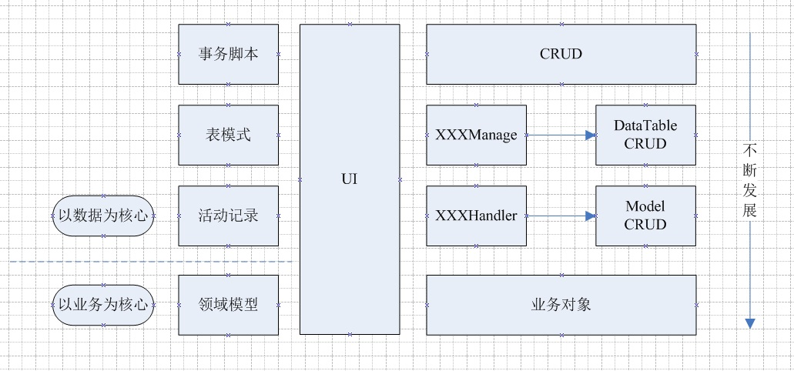
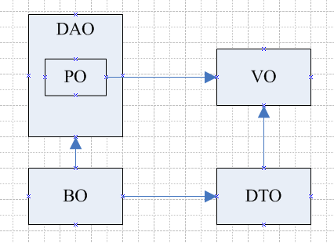

# Notes


## 业务逻辑层模式


* 事务脚本
```md
是一种最面向过程的组织方式，上层UI需要什么操作，下层就对应的写出处理方式。
一个方式从UI直接操作到DB，好处是上手快，方便书写，坏处嘛，复用性不够，针对复杂逻辑适应性极差。
```
* 表模式与活动记录
```md
比事务脚本进步的方面在于将数据库的表对象单独独立了出来，一个类对应一张数据库表。
独立的方式有所区别：表模式是一个DataTable对应一张表， 然后附上其CRUD，活动记录是一个Model实体类对应一张数据库表，然后附上其CRUD。
```
```md
这种方式对于单表操作，简单业务逻辑可能比较方便，但涉及到复杂业务，多表关联的时候，由于单表对应的类处理不了，
多数情况下仍然需要重新建立一个类，其命名类似于XXXManage,XXXHandler的方式，来专门处理这类复杂逻辑，多表操作的问题，其方法一般与UML的用例相关。
一旦业务足够复杂，项目规模足够大，这种方式仍然会引发复用性不够，针对复杂逻辑适应性极差等问题。
```
* 领域模型
```md
是大业务量，复杂逻辑的解决方式
完全抛弃首先建库的思想，紧紧围绕客户需求来进行分析，提炼业务主体，明确交互方式，构建出一个个有血有肉的对象。
最后按照客户需求或程序需要将数据或状态保存到数据库中。
```
### 总结
```md
事务脚本，表模块，活动记录 三种方式有个相同点，就是始终以数据为中心。
数据库的表结构，在程序逻辑中占有非常重要的位置，业务逻辑的处理，始终围绕着处理表数据来展开，业务代码编写人员，始终要比较明白数据库的设计方式。 
一个类的状态部分(属性)与行为部分(方法)始终分离，还谈不上真正的面向对象编程。
```
```md
活动记录的优点很多，缺点也很明显。最大的缺点就是由于是一张表对应一个模型，业务操作基本上都是基于单表的。
当发生跨表逻辑时，就无法应付了，这时只好求助于事务脚本，有时直接在Model里写事务脚本，
有时则在Model的上方建立一个XXXHandler或XXXManage来实现事务脚本。
如果对象间的关联越来越多, 你的事务脚本越来越庞大, 重复的代码越来越多，项目就不可控了。
```
```md
对于领域模型，其构建模式并不是一成不变的，其很多变种就与活动记录比较类似。
常规的方式，是领域模型直接与数据库映射，中间没有其它层。但是也有这样一个变种，在数据库与领域模型间加入实体层，
每一个实体对应一张表，领域模型以继承或重新编写的方式构建于实体之上。
实体仅有数据，其CRUD由上层或其它对象完成，或者实体可以自行实现自己的CRUD，领域模型则通过操作各个实体的CRUD来完成业务逻辑。
后面的一种架构方式，不就很象活动记录+领域模型的架构吗
```

```md
在整个软件架构过程中，BO（业务对象）通过DAO（数据访问对象）操作PO（持久对象）来实现业务逻辑。
对于VO（页面展示对象），在单表情况下多是直接展示PO，多表情况下多是将多个PO对象合并成一个DTO（数据传输对象）再进行展示。
对于实体仅有数据，其CRUD由上层或其它对象完成的这种情况，BO包含DAO对象。
对于实体自行实现自己的CRUD，BO与PO对象都包含DAO对象。
```
