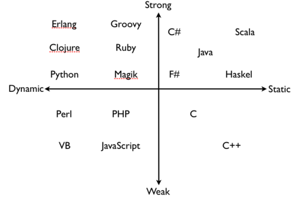

# 类型系统与编程语言

## 概念
### Program Errors
* trapped errors
```md
导致程序终止执行，如除0，Java中数组越界访问
```
* untrapped errors
```md
出错后继续执行，但可能出现任意行为。如C里的缓冲区溢出、Jump到错误地址
```

### Forbidden Behaviours
```md
语言设计时，可以定义一组forbidden behaviors.
它必须包括所有untrapped errors, 但可能包含trapped errors.
```

### Well behaved、ill behaved
```md
如果程序执行不可能出现forbidden behaviors, 则为well behaved。
ill behaved: 否则为ill behaved...
```


## 强、弱类型
* 强类型strongly typed
```md
如果一种语言的所有程序都是well behaved，则该语言为strongly typed。
```
* 弱类型weakly typed
```md
否则为weakly typed。

比如C语言的缓冲区溢出，属于trapped errors，即属于forbidden behaviors..故C是弱类型
```
## 动态、静态类型
* 静态类型 statically
```md
如果在编译时拒绝ill behaved程序，则是statically typed。
```
* * 静态类型可以分为两种：
```md
如果类型是语言语法的一部分，在是explicitly typed显式类型
如果类型通过编译时推导，是implicity typed隐式类型, 比如ML和Haskell
```
* 动态类型dynamiclly
```md
如果在运行时拒绝ill behaviors, 则是dynamiclly typed。
```

## 总结
```md
无类型： 汇编
弱类型、静态类型 ： C/C++
弱类型、动态类型检查： Perl/PHP
强类型、静态类型检查 ：Java/C#
强类型、动态类型检查 ：Python, Scheme
静态显式类型 ：Java/C
静态隐式类型 ：Ocaml, Haskell
```



> 参考：

* [《Type Systems》](http://homepage.divms.uiowa.edu/~tinelli/classes/185/Fall06/notes/cardelli-95.pdf)
* [《Type Systems for Programming Languages》](http://ropas.snu.ac.kr/~kwang/520/pierce_book.pdf)